# Jarkom-Modul-4-B07-2023
> Laporan Resmi Praktikum 4 Jaringan Komputer B07
***
## Anggota Kelompok B07
1. I Gusti Ngurah Ervan Juli Ardana (5025211205)
2. Danar Sodik Priyambodo (5025211145)

## Daftar isi
- [Topologi PKT VLSM](#topologi-pkt-vlsm)
- [Topologi GNS CIDR](#topologi-gns-cidr)
- [Rute](#rute)

- [VLSM](#vlsm)
  - [Tree](#tree)
  - [Pembagian IP](#pembagian-ip)
  - [Konfigurasi Network](#konfigurasi-network)
  - [Routing](#routing)
  - [Testing](#testing)
- [CIDR](#cidr)
  - [Tree](#tree-1)
  - [Pengelompokan Subnet](#pengelompokan-subnet)
  - [Pembagian IP](#pembagian-ip-1)
  - [Konfigurasi Network](#konfigurasi-network-1)
  - [Routing](#routing-1)
  - [Testing](#testing-1)


## Topologi PKT VLSM


## Topologi GNS CIDR 
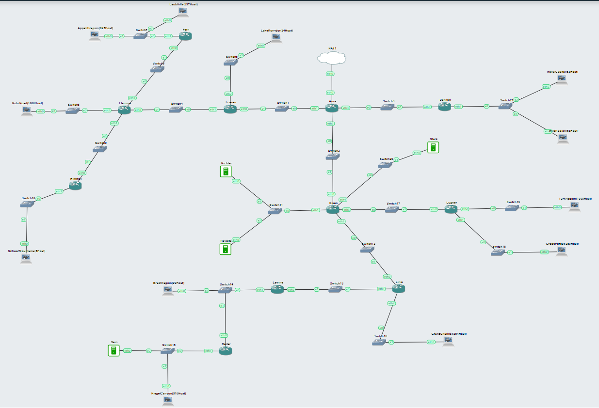

## Rute


Setelah membagi semua subnet beserta jumlah ip dan netmask pada masing masing netmask, selanjutnya kami mengumpulkan subnet yang memiliki netmask yang sama untuk memudahkan dalam membuat tree


## VLSM
Variable Length Subnet Masking (VLSM) adalah sebuah metode pengalamatan IP yang memungkinkan pengguna untuk menggunakan subnet mask dengan panjang yang bervariasi untuk mengoptimalkan penggunaan alamat IP dalam jaringan. VLSM memungkinkan kita untuk membagi alamat IP secara lebih efisien dengan mengalokasikan blok alamat yang lebih besar untuk subnet yang membutuhkan lebih banyak host dan blok alamat yang lebih kecil untuk subnet yang membutuhkan lebih sedikit host.
### Tree
Setelah kami membagi semua subnet dengan jumlah ip dan netmask, selanjutnya kita dapat membangun tree dari topologi yang telah kami miliki. Berikut merupakan tree dari topologi diatas


### Pembagian IP

Berdasarkan tree yang telah kami bentuk, selanjutnya kami dapat membagi ip kepada semua node yang ada berdasarkan subneting masing masing. berikut pembagianya:


### Konfigurasi Network

Setelah kami membagi ip kepada masing masing node, kami perlu melakukan konfigurasi ip kepada masing masing Node. Caramya sebagai berikut:

#### Router

- Pertama, Pilihlah Router yang akan dikonfigurasi kemudian klik pada router tersebut. kami akan contohkan pada router aura


- Kedua, Klik config setelah itu kalian akan diberikan beberapa pilihan via mulai dari fastethernet0/0 hingga fastethernet1/1. Setelah itu kalian hanya perlu melakukan konfigurasi berdasarkan pembagian ip yang telah ada diatas


 
- Selanjutnya, kita hanya perlu memasukan IPv4Address dan Subnet Mask berdasarkan pembagian subnetting masing masing. Contohnya Sebagai berikut:

##### Aura dan Fririen (A8) :


##### Aura dan Denken (A9) :


##### Aura dan Eisen (A11) :


- Lakukanlah langkah yang sama pada setiap Router yang ada
  
#### Client atau Server

- Pertama, Pilihlah Client/Server yang akan dikonfigurasi kemudian klik pada Client/Server tersebut. kami akan contohkan pada Client Lakekorridor


- Kedua, Klik dekstop untuk mencari pilihan ip configuration


- Ketiga, Klik ipconfiguration. setelah itu kalian akan diminta untuk mengisi IPv4Address dan Subnet Mask. Setelah itu kalian hanya perlu melakukan konfigurasi berdasarkan pembagian ip yang telah ada diatas. Contohnya pada client Lakekorridor yang berhubungan dengan Router Frieren dengan subnet A2. Berikut konfigutasinya


- Lakukanlah langkah yang sama pada setiap Client/Server yang ada
  
### Routing
Static Routing mengharuskan administrator jaringan untuk menambahkan/ memberitahukan rute (route) baru ke dalam tabel routing ketika terdapat subnet tambahan dalam jaringannya. Konsep static routing sederhana, daftarkan NID dan netmask yang ada serta tentukan gateway untuk menuju ke subnet tersebut. Caranya sebagai berikut

- Klik, setiap Route yang ingin dilakukan Routing. Kami contohkan menggunakan Router Aura
  
 

- Setalah itu, Pada menu Config, terdapat pilihan Routing, kemudian klik Static untuk menambahkan route pada Router yang terdiri dari Network, Mask, dan Next Hop
  
  

- Kemudian Isi satu persatu route, kemudian klik "Add" hingga seluruh route dari router tersebut ditambahkan. kami akan mencontohkan menggunakan Router Aura
  - Kiri
    #### A7 via Frieren
    ```
    Network : 10.12.24.64
    Mask : 255.255.255.224
    Next Hop : 10.12.24.126
    ```
    #### A4 via Frieren
    ```
    Network : 10.12.24.116
    Mask : 255.255.255.252
    Next Hop : 10.12.24.126
    ```
    #### A2 via Frieren
    ```
    Network : 10.12.24.112
    Mask : 255.255.255.252
    Next Hop : 10.12.24.126
    ```
    #### A1 via Frieren
    ```
    Network : 10.12.0.0
    Mask : 255.255.248.0
    Next Hop : 10.12.24.126
    ```
    #### A3 via Frieren
    ```
    Network : 10.12.8.0
    Mask : 255.255.252.0
    Next Hop : 10.12.24.126
    ```
    #### A5 via Frieren
    ```
    Network : 10.12.24.120
    Mask : 255.255.255.252
    Next Hop : 10.12.24.126
    ```
    #### A6 via Frieren
    ```
    Network : 10.12.24.96
    Mask : 255.255.255.248
    Next Hop : 10.12.24.126
    ```
  - Kanan
    #### A10 via Denken
    ```
    Network : 10.12.22.0
    Mask : 255.255.255.0
    Next Hop : 10.12.24.130
    ```
  - Bawah
    #### A12 via Eisen
    ```
    Network : 10.12.28.136
    Mask : 255.255.255.252
    Next Hop : 10.12.28.134
    ```
    #### A13 via Eisen
    ```
    Network : 10.12.24.104
    Mask : 255.255.255.248
    Next Hop : 10.12.28.134
    ```
    #### A14 via Eisen
    ```
    Network : 10.12.28.140
    Mask : 255.255.255.252
    Next Hop : 10.12.28.134
    ```
    #### A15 via Eisen
    ```
    Network : 10.12.12.0
    Mask : 255.255.252.0
    Next Hop : 10.12.28.134
    ```
    #### A16 via Eisen
    ```
    Network : 10.12.23.0
    Mask : 255.255.255.0
    Next Hop : 10.12.28.134
    ```
    #### A17 via Eisen
    ```
    Network : 10.12.24.144
    Mask : 255.255.255.252
    Next Hop : 10.12.28.134
    ```
    #### A18 via Eisen
    ```
    Network : 10.12.20.0
    Mask : 255.255.254.0
    Next Hop : 10.12.28.134
    ```
    #### A19 via Eisen
    ```
    Network : 10.12.24.148
    Mask : 255.255.255.252
    Next Hop : 10.12.28.134
    ```
    #### A20 via Eisen
    ```
    Network : 10.12.24.0
    Mask : 255.255.255.192
    Next Hop : 10.12.28.134
    ```
    #### A21 via Eisen
    ```
    Network : 10.12.16.0
    Mask : 255.255.252.0
    Next Hop : 10.12.28.134
    ```
- Lakukanlah langkah yang sama pada setiap router yang kalian miliki
  
### Testing

https://github.com/NgurahErvan/Jarkom-Modul-4-B07-2023/assets/114007640/c325ac4d-4feb-422c-98ba-ed4e2f0da27b

## CIDR
CIDR (Classless Inter-Domain Routing) adalah metode subnetting dan routing jaringan yang tidak terikat pada kelas alamat IP, memungkinkan pembagian fleksibel dari blok alamat dengan notasi CIDR, seperti 192.168.1.0/24. Ini memperbolehkan efisiennya penggunaan alamat IP dengan mengelola subnet yang lebih kecil dan memfasilitasi agregasi alamat IP untuk mengurangi jumlah entri dalam tabel routing. Dengan CIDR, administrator dapat memadukan beberapa subnet ke dalam satu entri routing yang lebih umum, menyederhanakan manajemen alamat IP dan meningkatkan efisiensi dalam proses routing. Bayangkan alamat IP sebagai nomor rumah, dan CIDR memungkinkan kita untuk membagi-baginya dengan cara yang lebih fleksibel. Misalnya, alamat IP seperti 192.168.1.0/24 berarti kita memiliki sekitar 256 nomor rumah di sana. CIDR membantu kita mengelola nomor-nomor ini dengan lebih baik dan membuat internet berjalan lebih cepat dengan menggabungkan beberapa rumah ke dalam satu nomor yang lebih besar. Jadi, CIDR membantu internet menjadi lebih terorganisir dan efisien.

### Tree
Ini merupakan tree yang didapat dari topologi yang kita gunakan, hasil dari tree ini memerlukan beberapa proses subneting untuk beberapa subnet-subnet yang ada sehingga di dapat tree dengan pembagian IP yang efisien

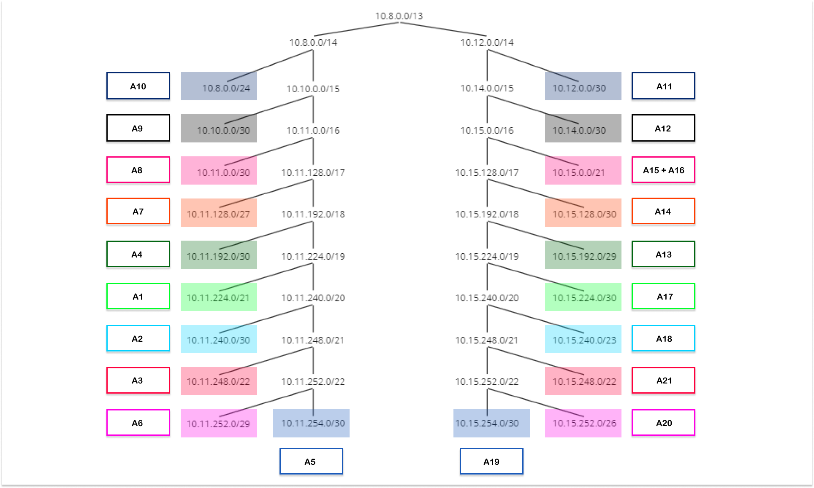

**Perlu diketahui bahwa, Prefix IP dari kelompok kita merupakan 10.12.x.x , namun dikarenakan mask yang sangat kecil atau nilai ip yang dangat besar, maka terjadi pergeseran IP sehingga prefix IP dari kelompok kita menjadi 10.8.x.x . hal tersebut dikarenakan mask /13, memerlukan bits kedua pada ip yang dimana hal tersebut berpengaruh pada IP prefix kelompok, sehingga output yang dapat digunakan adalah 10.8.x.x .**

Sebelum menentukan tree tersebut, kita melakukan pengelompokan pada topologi yang kita gunakan, dengan gambaran seperti berikut

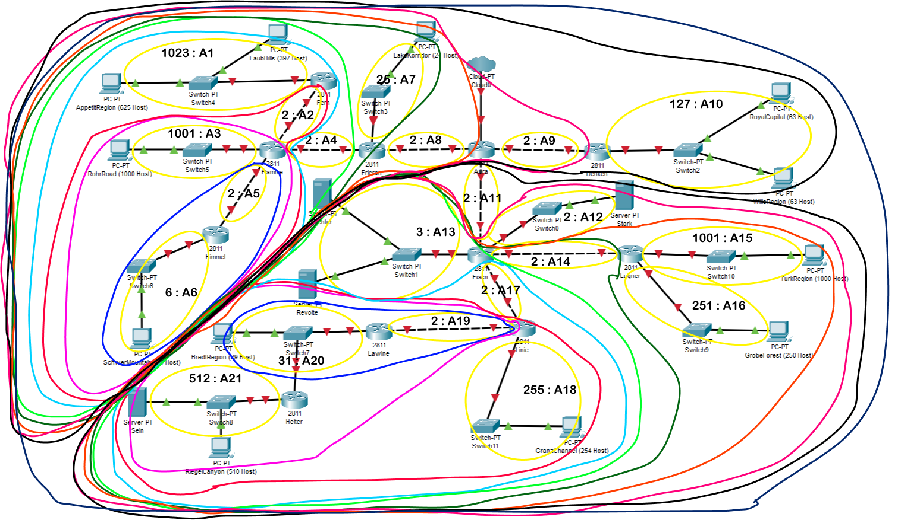

Pengelompokan tersebut terlihat sangat sulit untuk dipahami, jadi subneting dari VLSM dilakukan subneting lagi menjadi bagian subnet yang lebih besar dan secara bertahap, pada topologi ini, kita melakukan pembagian menjadi 2 subneting besar kemudian baru menjadikannya 1 di akhir dan menghitung mask dari total subneting yang telah dibuat, gambaran sederhana dari hasil subneting tersebut dapat dilihat pada gambar berikut.

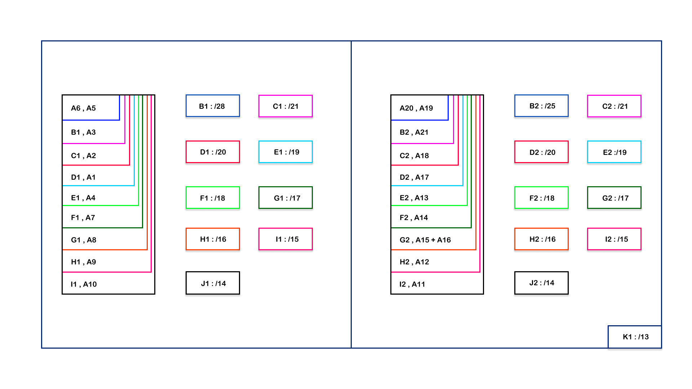

penjelasan singkat, misal pada bagian kiri, A6 dan A5 digabung menjadi sebuah subnet, kemudian dibandingkan mask dari kedua tersebut, dan didapat mask yang paling kecil adalah /29, dengan rumus CIDR maka harus dilakukan pengurangan 1 pada mask tersebut, sehingga didapat subnet B1 dengan mask /28. kemudian langkah selanjutnya, pada subnet B1 dilakukan subneting lagi dengan node sebelahnya yaitu A3, dan dibandingkan untuk mask kedua node tersebut, didapat /22, dan dengan rumus CIDR maka dikurangi 1 pada mask tersebut menjadi /21. begitu seterusnya hingga didapat subnet terbesar yaitu K1 dengan mask /13 yang menggabungkan antara 2 bagian subnet yang telah dibuat sebelumnya. 

### Pengelompokan Subnet
Dengan perhitungan yang didapat pengelompokan subnet yang didapatkan sebagai berikut.
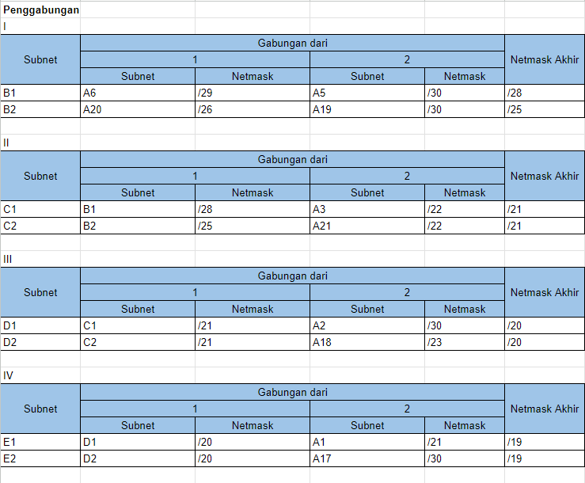
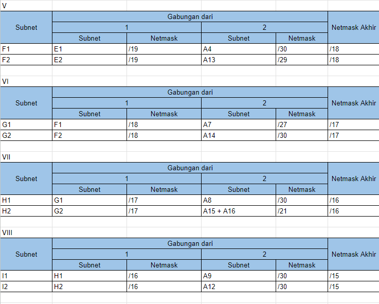
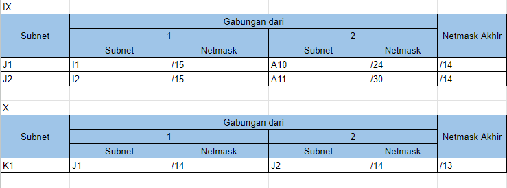

### Pembagian IP
Dengan pengelompokan tersebut, dapat didapatkan pembagian IP pada masing masing node sebagai berikut.

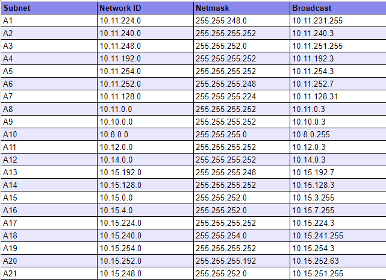

### Konfigurasi Network
Konfigurasi network pada GNS3 dapat dilakukan dengan cara membagikan ip dan netmask statics ke masing masing node untuk dilakukan inisialisasi IP agar node tersebut dapat dikenali oleh node yang lain dan dapat saling terhubung. IP yang dibagikan dapat diambil dari perhitungan CIDR yang telah dilakukan sebelumnya dengan menggunakan range usable ip yang dapat digunakan. berikut merupakan contoh yang dapat kami berikan pada node Aura. 

- Aura
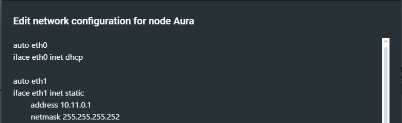
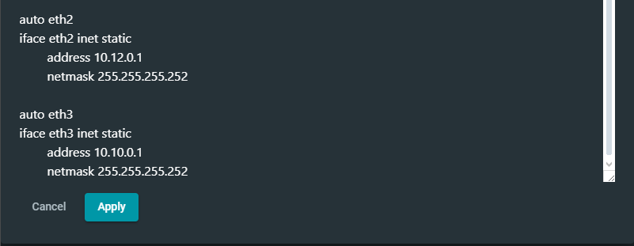

- Frieren
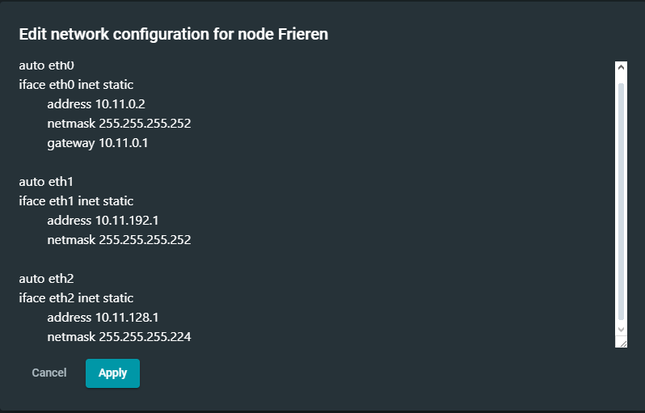

- Eisen
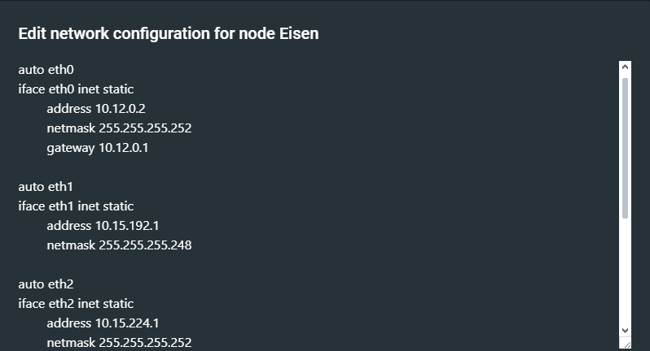
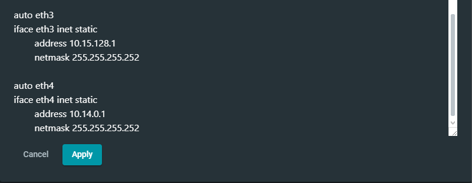

- Denken
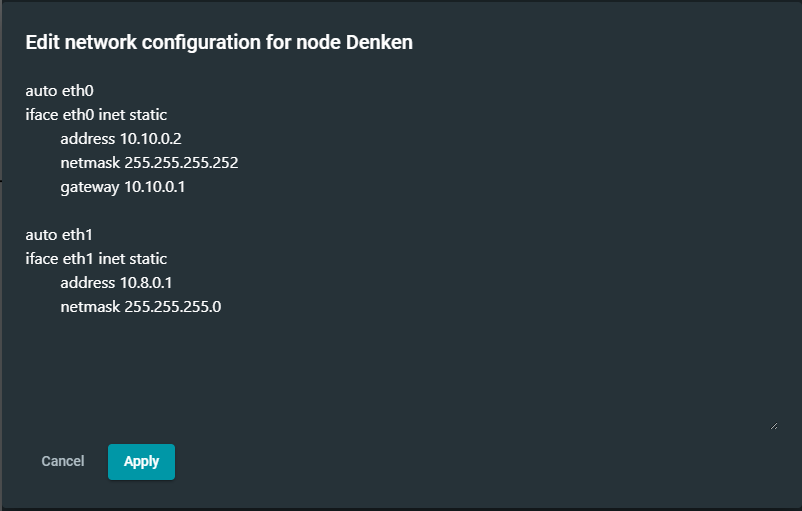

Semua pembagian Ip pada router juga berlaku sesuai dengan pembagian ip yang sudah dilakukan perhitungan sebelumnya. pengaturan config juga dilakukan pada edge device atau ujung dari setiap topoligi entah itu client maupun server. berikut contoh node lanjutan client dari denken.

- Royal Capital (63 Host)
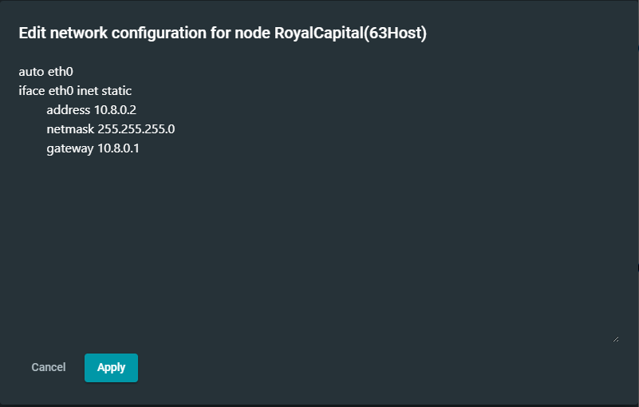

- Wile Region (63 Host)


Konfigurasi dilakukan pada semua node yang ada dari router sampai client maupun server, semua dilakukan dengan pembagian IP yang telah dilakukan.

### Routing
Sama halnya seperti VLSM yang dilakukan routing pada `Cisco packet tracker`, pada GNS3 CRID juga harus dilakukan routing untuk menentukan route atau rute mana yang saling terhubung satu sama yang lain. Routing dilakukan pada setiap router, router akan meneruskan permintaan yang dilakukan pada client apabila ingin melakukan ping pada subnet yang jauh, maka fungsi router itu sendiri untuk menghubungkan jaringan atau subnet yang telah dibuat agar dapat menjangkau node yang jauh, mengetahu rute yang ingin ditempuh sehingga dapat sampai pada node yang diinginkan dengan cepat dan tepat.

berikut merupakan langkah-langkah sederhana yang dapat dilakukan pada router untuk melakukan routing pada GNS3 secara manual dengan memasukkan command berikut kedalam terminal router.

```
route add -net <NID subnet> netmask <netmask> gw <IP gateway>
```

dimana NID merupakan NID dari pembagian IP sebelumnya, netmask juga merupakan perhitungan netmask yang didapat dari NID, kemudian IP gateway merupakan jalur yang harus ditempuh untuk meneruskan request yang dilakukan.

setelah melakukan command tersebut dapat dilakukan pengecekan dengan menggunakan command

```
route -n
```
maka akan muncul list route yang telah ditambahkan seperti berikut

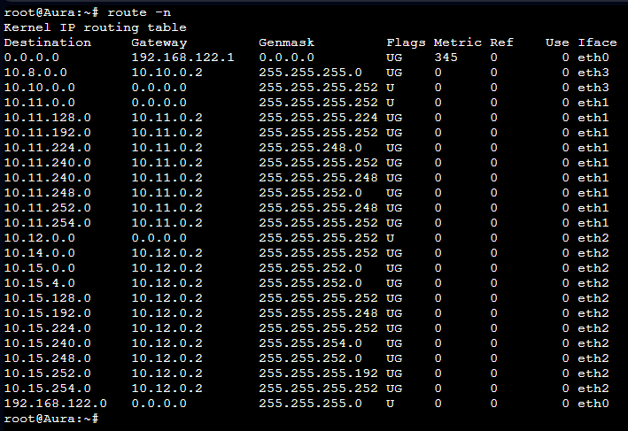

untuk melakukan static routing disesuaikan dengan daftar NID yang ada. Semakin banyak NID dalam suatu topologi, semakin banyak pula rute yang perlu ditambahkan ke router, maka diperlukan teknik pengelompokkan (Subnetting) yang tepat untuk menyederhanakan Routing.

berikut merupakan command yang digunakan untuk setiap node melakukan routing pada topologi yang kita gunakan.

- Aura
```
route add -net 10.11.128.0 netmask 255.255.255.224 gw 10.11.0.2 
route add -net 10.11.192.0 netmask 255.255.255.252 gw 10.11.0.2 
route add -net 10.11.240.0 netmask 255.255.255.252 gw 10.11.0.2 
route add -net 10.11.224.0 netmask 255.255.248.0 gw 10.11.0.2 
route add -net 10.11.248.0 netmask 255.255.252.0 gw 10.11.0.2 
route add -net 10.11.254.0 netmask 255.255.255.252 gw 10.11.0.2 
route add -net 10.11.240.0 netmask 255.255.255.248 gw 10.11.0.2 
route add -net 10.11.252.0 netmask 255.255.255.248 gw 10.11.0.2
route add -net 10.8.0.0 netmask 255.255.255.0 gw 10.10.0.2 
route add -net 10.14.0.0 netmask 255.255.255.252 gw 10.12.0.2 
route add -net 10.15.192.0 netmask 255.255.255.248 gw 10.12.0.2 
route add -net 10.15.128.0 netmask 255.255.255.252 gw 10.12.0.2 
route add -net 10.15.0.0 netmask 255.255.252.0 gw 10.12.0.2 
route add -net 10.15.4.0 netmask 255.255.252.0 gw 10.12.0.2 
route add -net 10.15.224.0 netmask 255.255.255.252 gw 10.12.0.2 
route add -net 10.15.240.0 netmask 255.255.254.0 gw 10.12.0.2 
route add -net 10.15.254.0 netmask 255.255.255.252 gw 10.12.0.2 
route add -net 10.15.252.0 netmask 255.255.255.192 gw 10.12.0.2 
route add -net 10.15.248.0 netmask 255.255.252.0 gw 10.12.0.2
```

- Frieren
```
route add -net 0.0.0.0 netmask 0.0.0.0 gw 10.11.0.1
route add -net 10.11.248.0 netmask 255.255.252.0 gw 10.11.192.2 
route add -net 10.11.240.0 netmask 255.255.255.252 gw 10.11.192.2 
route add -net 10.11.224.0 netmask 255.255.248.0 gw 10.11.192.2 
route add -net 10.11.252.0 netmask 255.255.255.248 gw 10.11.192.2 
route add -net 10.11.254.0 netmask 255.255.255.252 gw 10.11.192.2
```

- Flamme
```
route add -net 0.0.0.0 netmask 0.0.0.0 gw 10.11.192.1
route add -net 10.11.224.0 netmask 255.255.248.0 gw 10.11.240.2
route add -net 10.11.252.0 netmask 255.255.255.248 gw 10.11.254.2
```

- Fern
```
route add -net 0.0.0.0 netmask 0.0.0.0 gw 10.11.240.1
```

- Himmel
```
route add -net 0.0.0.0 netmask 0.0.0.0 gw 10.11.254.1
```

- Denken
```
route add -net 0.0.0.0 netmask 0.0.0.0 gw 10.10.0.1
```

- Eisen
```
route add -net 0.0.0.0 netmask 0.0.0.0 gw 10.12.0.1 
route add -net 10.15.0.0 netmask 255.255.252.0 gw 10.15.128.2 
route add -net 10.15.4.0 netmask 255.255.252.0 gw 10.15.128.2 
route add -net 10.15.254.0 netmask 255.255.255.252 gw 10.15.224.2 
route add -net 10.15.240.0 netmask 255.255.254.0 gw 10.15.224.2 
route add -net 10.15.252.0 netmask 255.255.255.192 gw 10.15.224.2 
route add -net 10.15.248.0 netmask 255.255.252.0 gw 10.15.224.2
```

- Lugner
```
route add -net 0.0.0.0 netmask 0.0.0.0 gw 10.15.128.1
```

- Linie
```
route add -net 0.0.0.0 netmask 0.0.0.0 gw 10.15.224.1
route add -net 10.15.252.0 netmask 255.255.255.192 gw 10.15.254.2
route add -net 10.15.248.0 netmask 255.255.252.0 gw 10.15.254.2
```

- Lawine
```
route add -net 0.0.0.0 netmask 0.0.0.0 gw 10.15.254.1
route add -net 10.15.248.0 netmask 255.255.252.0 gw 10.15.252.3
```

- Heiter
```
route add -net 0.0.0.0 netmask 0.0.0.0 gw 10.15.252.1
```

### Testing
- Video Testing

[](https://youtu.be/4yjJ4sE2GxE)